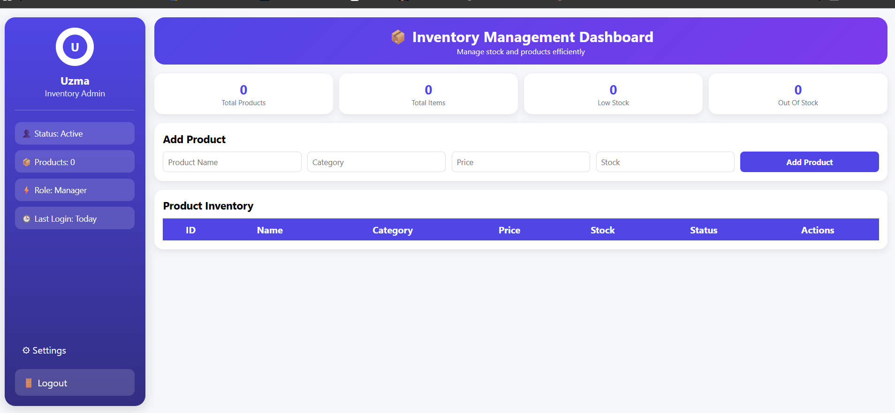

# Inventory Management System

A web-based Inventory Management System built using FastAPI, SQLite, SQLAlchemy, and Jinja2. The application allows users to manage product inventory, update stock levels, monitor low-stock products, and prevent invalid inventory operations through a simple and user-friendly dashboard.

---

# Assignment Requirements Coverage

| Requirement            | Implementation                                                                                                                         |
| ---------------------- | -------------------------------------------------------------------------------------------------------------------------------------- |
| Add Product Inventory  | Users can add products with name, category, price, and stock quantity through the dashboard form.                                      |
| Update Stock           | Stock can be increased or decreased directly from the inventory table using action buttons.                                            |
| Prevent Negative Stock | Backend validation prevents stock values below zero and the UI displays a warning message when users attempt invalid stock reductions. |
| Display Products       | All products are displayed in a structured inventory table showing complete product details and stock status.                          |
| Show Low Stock Items   | Products with stock less than or equal to 3 are automatically highlighted and counted in dashboard statistics.                         |

---

# Project Overview

The goal of this project was to create a simple inventory management solution that allows users to track products and manage stock levels efficiently.

The system provides:

* Product creation and storage
* Inventory tracking
* Stock updates
* Low-stock monitoring
* Inventory statistics dashboard
* Validation against negative stock values

Beyond the core requirements, the solution includes a modern dashboard interface, inventory statistics cards, stock status indicators, low-stock monitoring, and user-friendly validation mechanisms.

The application provides a centralized dashboard for managing inventory efficiently while maintaining inventory accuracy through backend and frontend validation.

---

# Technology Stack

| Technology | Purpose                              |
| ---------- | ------------------------------------ |
| FastAPI    | Backend framework and route handling |
| SQLite     | Local database storage               |
| SQLAlchemy | Database ORM                         |
| Jinja2     | Dynamic HTML rendering               |
| HTML & CSS | Frontend dashboard interface         |
| Python     | Core programming language            |

---

# Technology Choices

### FastAPI

FastAPI was selected because it is lightweight, fast, and easy to develop with. It provides clean route organization, automatic validation support, and excellent performance.

### SQLite

SQLite was chosen because it requires no additional database setup and is ideal for assignment-scale applications.

### SQLAlchemy

SQLAlchemy simplifies database operations through object-oriented models and reduces the need for writing raw SQL queries.

### Jinja2

Jinja2 enables dynamic rendering of inventory data directly into HTML templates.

---

# Features Implemented

## Core Features

### 1. Product Inventory Management

Users can create products by providing:

* Product Name
* Category
* Price
* Initial Stock Quantity

The product information is stored in the SQLite database and displayed immediately on the dashboard.

---

### 2. Stock Management

Each product includes stock control buttons:

* Increase Stock (+)
* Decrease Stock (-)

This allows inventory quantities to be updated quickly without manually editing records.

---

### 3. Negative Stock Prevention

The application prevents inventory quantities from becoming negative.

#### Backend Validation

Before updating stock, the system checks:

```python
new_stock = current_stock + change

if new_stock < 0:
    return error
```

Invalid updates are rejected and never saved to the database.

#### Frontend Validation

When stock reaches zero and a user attempts another reduction, a popup warning appears:

```text
❌ Negative stock is not allowed!
```

This improves user experience while maintaining data integrity.

---

### 4. Product Display

All products are displayed in a structured inventory table showing:

* Product ID
* Product Name
* Category
* Price
* Stock Quantity
* Stock Status

---

### 5. Low Stock Monitoring

Products with stock less than or equal to 3 are automatically classified as Low Stock.

This helps users identify products that may require replenishment.

---

## Additional Features

### Dashboard Statistics

The dashboard includes summary cards displaying:

* Total Products
* Total Inventory Items
* Low Stock Products
* Out of Stock Products

---

### Stock Status Indicators

Products are automatically categorized using visual indicators:

| Status       | Condition |
| ------------ | --------- |
| Good Stock   | Stock > 3 |
| Low Stock    | Stock ≤ 3 |
| Out of Stock | Stock = 0 |

---

### User-Friendly Dashboard

The application includes:

* Sidebar navigation
* Inventory summary cards
* Responsive product table
* Stock update controls
* Visual inventory indicators

---

# Project Structure

```text
inventory-management-system/
│
├── database.py
├── models.py
├── schemas.py
├── main.py
├── inventory.db
│
├── templates/
│   └── index.html
│
├── requirements.txt
└── README.md
```

## File Responsibilities

### database.py

Configures SQLite database connectivity and SQLAlchemy sessions.

### models.py

Defines the Product database model.

### schemas.py

Contains validation schemas for incoming requests.

### main.py

Handles application routes, inventory operations, and business logic.

### index.html

Contains the dashboard user interface and inventory display.

---

# Route Organisation

| Route                                 | Method | Purpose                         |
| ------------------------------------- | ------ | ------------------------------- |
| `/`                                   | GET    | Display dashboard and inventory |
| `/add-product`                        | POST   | Add a new product               |
| `/update-stock/{product_id}/{change}` | POST   | Update stock quantity           |
| `/products`                           | GET    | Retrieve all products           |
| `/products`                           | POST   | Create product via API          |
| `/products/{product_id}/stock`        | PUT    | Update stock via API            |
| `/products/low-stock`                 | GET    | Retrieve low-stock products     |

---

# Application Workflow

```text
User Opens Dashboard
          │
          ▼
      Add Product
          │
          ▼
 Product Stored in Database
          │
          ▼
 Product Displayed in Table
          │
          ▼
   User Updates Stock
          │
          ▼
  System Validates Update
          │
          ▼
 Prevent Negative Stock
          │
          ▼
 Update Dashboard Statistics
```

---

# Database Design

## Products Table

| Column   | Type    | Description              |
| -------- | ------- | ------------------------ |
| id       | Integer | Primary Key              |
| name     | String  | Product Name             |
| category | String  | Product Category         |
| price    | Float   | Product Price            |
| stock    | Integer | Available Stock Quantity |

---

# Assumptions Made

| Assumption                         | Reason                                          |
| ---------------------------------- | ----------------------------------------------- |
| Stock cannot be negative           | Inventory quantities should never be below zero |
| Low stock threshold is 3           | Provides a simple replenishment indicator       |
| Products remain visible at stock 0 | Users may restock products later                |
| Single administrator usage         | Authentication is outside assignment scope      |
| SQLite is sufficient               | Suitable for lightweight local applications     |

---

# Validation & Error Handling

The system includes multiple validation layers.

## Product Validation

* Product name is required
* Category is required
* Price must be positive
* Stock cannot be negative

## Stock Validation

Before updating stock:

```python
new_stock = current_stock + change

if new_stock < 0:
    return error
```

Negative stock values are never saved.

## User Validation

If users attempt to reduce stock below zero:

```text
❌ Negative stock is not allowed!
```

is displayed.

---


# Use of AI During Development

## AI Tool Used

### ChatGPT

ChatGPT was used as a development assistant throughout the project.

### Requirement Analysis

AI helped break down the assignment requirements into smaller development tasks and identify the best implementation approach.

### Backend Development

Assistance was used for:

* FastAPI route planning
* SQLAlchemy model creation
* Database integration
* Validation logic

### Frontend Development

Suggestions were used for:

* Dashboard layouts
* Table design
* Stock status indicators
* Responsive styling

### Debugging

AI assisted in troubleshooting:

* Route issues
* Template rendering errors
* Database updates
* Validation edge cases

### Documentation

ChatGPT helped structure and refine the README documentation.

### Developer Responsibility

All AI-generated suggestions were reviewed, tested, modified, and validated before being included in the final solution. Final implementation decisions remained entirely under developer control.


---

# Challenges Encountered

### Inventory Validation

Ensuring stock values never became negative while still providing a smooth user experience required validation at both the backend and frontend levels.

### Dashboard Design

Creating a dashboard that clearly communicated inventory status required thoughtful use of statistics cards, stock indicators, and status labels.

### Data Consistency

Ensuring inventory statistics remained synchronized with stock updates required careful handling of database operations and page rendering.

---

# Future Enhancements

* Product editing functionality
* Product deletion functionality
* Search and filtering by product name or category
* Export inventory data to Excel or PDF
* User authentication and authorization
* Inventory analytics and charts
* Inventory transaction history

---

# Setup and Run Instructions

## Clone Repository

```bash
git clone <repository-url>
cd inventory-management-system
```

## Create Virtual Environment

```bash
python -m venv venv
```

### Windows

```bash
venv\Scripts\activate
```

### Linux / macOS

```bash
source venv/bin/activate
```

## Install Dependencies

```bash
ppython -m pip install fastapi uvicorn jinja2 sqlalchemy python-multipart
```

## Run Application

```bash
uvicorn main:app --reload
```

## Open Application

```text
http://127.0.0.1:8000
```

---
# 17. Screenshots

## Dashboard



## Products Added


## Low Stock Display


## Out of stock Indicator


## Negative Stock Prevention Pop-Up


---

# Conclusion

This project successfully fulfills all requirements of the Inventory Management System case study. The application enables product management, stock updates, low-stock monitoring, and negative stock prevention through a clean and user-friendly interface.

By leveraging FastAPI, SQLite, SQLAlchemy, and Jinja2, the solution demonstrates structured backend development, database integration, validation handling, and dashboard design while maintaining simplicity and scalability for future enhancements.


